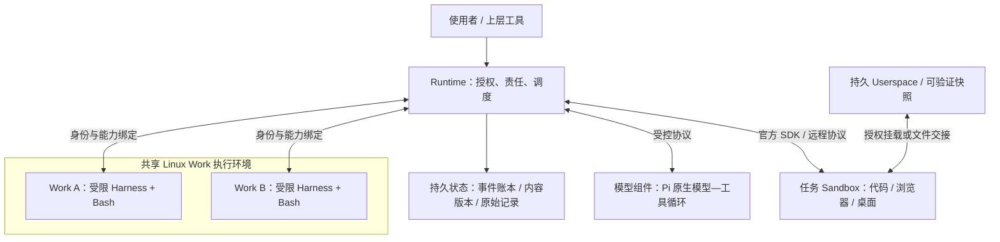

# Loom 系统规格

本文件定义系统的目标、边界、开发原则与不变量，是产品要求的唯一来源。它描述系统应当是什么，不表示现有实现已经满足要求。[目标架构](docs/architecture-target.md) 补充落地设计；[实现架构](docs/architecture.md)、无版本前缀的 [contracts](docs/contracts/) 和源码描述当前实现。协议字段、依赖版本、命令及测试结果不在这里固定。

## 1. 系统目标

Loom 是一个中立、持久、可恢复的 Harness Runtime：让普通代码编写的 Agent 策略，围绕可持续维护的工作资料，使用模型与隔离任务环境长期推进工作。工作可以等待外部条件、协作、恢复、迁移和分叉，其责任与记忆不依赖某个常驻 Agent 进程。

- 把 Runtime 做成中立、持久、可恢复的 Harness 底座。Runtime 提供事件与责任托管、授权、调度与唤醒，以及调用外部组件推进工作的能力；它不内置某一种任务策略。
- 把 Harness 做成使用普通代码编写的可替换推进策略。投影、上下文控制、工具配置与事件处理是其职责；不限制编程语言或表达方式，限制执行环境与权限。Plan 等业务辅助能力是可选扩展。
- Work 是数据与策略的持久单元，携带继续工作所需的全部可移植状态：Surface、实际使用过的 Harness 版本、完整事实与待办责任、可见性状态、当前投影、已确认继续点、版本、完整模型/工具记录，以及可验证的外部依赖。宿主授权、物理路径身份和凭据不随 Work 携带。
- Surface 是长期维护、每次投影均据以组织上下文的模板及其引用文件；模型用普通文件工具维护它。Userspace 是任务代码、数据和产物的执行对象。Work 执行与任务执行是不同的授权域。
- Surface 与选定事实经 Harness 投影后交给模型组件，得到模型可见上下文。当前投影可以持久保存和复用；完整事实始终保留，归档只改变可见性，模型能够通过上下文控制策略调整自己的后续输入。
- 同一部署的 Work 默认共用一个 Linux 执行环境与文件系统，按 Work 区分身份和访问权限，活跃时运行受限进程。不同 Work 可以按授权读取彼此的 Surface；不要求每个 Work 拥有独立容器或虚拟机。任务 Sandbox 是独立组件，通过远程协议访问。
- Work 初始化与 fork 使用普通目录组装加注册。Harness 的 Git 分支与 worktree 由上层管理；Runtime 只接收 Harness 目录并绑定执行版本，不解释分支、继承或合并关系。
- 支持多种 Harness 在同一底座上独立演进，并允许在隔离写入和副作用的前提下做策略比较；替换策略不应要求修改 Runtime 的通用机制。
- 支持长程工作。等待期间不保留任务专属 Agent 进程、长连接或沙箱，恢复所需状态必须持久化；条件满足时按外部定义重新拉起推进。
- 支持可恢复的多 Surface 事件交付：已经发生的输入不能因检查/订阅竞态、进程退出或重复通知而永久丢失，依赖关系由外部代码定义。
- 分别验证等待任务的驻留规模和活跃任务的吞吐量。单 Surface 闭环、单次真实运行或组件测试都不是完整系统目标的替代品。

## 2. 总体架构与系统边界

系统分为三个平面：**Runtime 控制面、Work 数据与策略面、任务 Sandbox 执行面**。Work 本身持久存在，临时加载的是它的执行进程。计算与持久状态分离，Work 执行与用户任务执行属于不同授权域。

这里的隔离指可验证的文件、进程、网络、权限和资源边界，不要求不同物理机器；共享内核的受限进程也不能宣称具有独立虚拟机的隔离强度。单机不是产品上限，多实例部署仍须满足单 Work 的排他写入与责任约束。



| 组件 | 负责 | 职责与权限上限 |
| --- | --- | --- |
| Runtime | Work 注册、输入受理、宿主授权、排他推进、事件交付与唤醒、效果及继续点托管、资源生命周期协调 | 不组装业务 Prompt、不决定任务策略、不解释业务完成、不复制模型循环 |
| 事件与责任底座 | 稳定请求身份、不可变事实、待处理责任、Round、效果、订阅及交付进度的持久记录 | 存储和交付机制不决定上下文可见性或任务依赖关系 |
| Harness | Surface 渲染、事实选择、工具配置、继续/等待决定、事件处理与协作策略 | 任意普通语言；与 Work Bash 受同一授权上限约束，无宿主管理凭据 |
| 模型组件 | Provider 编解码、原生消息、活跃模型—工具循环与原生继续点 | 不自行裁剪、归档或摘要上下文，不拥有 Work 调度与授权 |
| Work 执行设施 | 共享 Linux 环境、按 Work 身份执行、受限文件视图、进程与资源限制 | 不以工作目录代替隔离，不默认开放控制端点或任务资源 |
| Sandbox 平台 | 实例创建、任务执行、文件交接、原生状态查询、取消及释放 | 不拥有核心记忆和 Work 控制数据，不决定业务终态 |
| 上层工具 | Work 模板组装、Harness 分支/worktree、fork 与交互入口 | 不绕过 Runtime 的责任和授权，不把 Git 分支语义放入内核 |
| 宿主部署设施 | 身份映射、服务绑定、凭据与物理授权配置 | 不随 Work 导出，不由模型或 Harness 自报 |

Harness 决定为何推进及使用什么能力；Runtime 决定是否获准、如何保存责任并交接；Pi 负责活跃的模型—工具局部循环；Sandbox 负责实际任务执行。工具请求经 Runtime 授权和效果托管后才下发，Harness 或模型不能另开未记账的控制路径。

Loom 不自建 provider 协议、第二套模型循环、版本控制引擎、容器引擎、浏览器或桌面自动化引擎。业务计划、父子任务关系、固定 DAG 和通用业务完成判断不属于 Runtime。

## 3. 核心概念与状态归属

| 概念 | 定义 |
| --- | --- |
| Work | 数据、策略和持久责任的可移植单元，不等于进程、容器或虚拟机 |
| Surface | 长期维护的上下文模板及其引用资料；普通文件，不是完整事实库 |
| Fact（事实记录） | 已保存的输入、请求、结果或观测，证明系统收到了什么，不自动证明内容为真或任务成功 |
| Projection（投影） | Harness 根据 Surface、选定事实及明确来源生成的模型上下文；可持久保存的派生结果 |
| Userspace | 用户任务的代码、数据和产物，其持久存储与 Sandbox 实例分离 |
| Round（推进回合） | 一次受托推进，绑定排他写入者、输入边界与策略版本，可以包含多个模型轮次和工具调用 |
| Effect（效果） | 可能影响外部系统的调用，含模型请求、执行请求和跨 Work 交付；具有稳定身份、请求绑定及结果状态 |
| Checkpoint（检查点） | 关联事实边界、内容版本、投影、执行阶段和效果状态的已确认继续依据，不是任意进程或整机快照 |

完整事实和已受理责任由 Runtime 受控账本及其引用的不可变记录托管；Surface、Userspace 和策略代码是版本化文件；可见性状态表达 Harness 的选择；投影、索引和事实文件视图是派生数据。Git 不替代事件账本，数据库不重新实现文件版本引擎。

目标技术基线：Go Runtime；Git 保存内容版本；普通不可变文件保存大记录；Pi 提供模型适配和局部循环；JSON-RPC 连接策略/模型边界；成熟 Linux 隔离设施承载 Work；任务执行优先复用 OpenSandbox 与官方 SDK。

**事件底座暂用基线：SQLite 事务保存事件与控制责任。** 这沿用最新已保存目标；历史设计曾选择 NATS JetStream，是否恢复该选择仍待确认，具体依据见 [事件底座与存储分工](docs/architecture-target.md#事件底座与存储分工)。SQLite 是账本，不是已提供完整调度、订阅和唤醒的事件平台；这些通用责任仍由 Runtime 承担。本项不以当前实现代替选型决定，也不把未确认方案列为并行生产路径。

## 4. Work、Surface 与 Userspace

以下是逻辑布局示例，不固定业务文件名或可见性文件格式：

```text
work/
  work.toml             入口、模型语义、逻辑服务与环境要求；不含秘密
  harness/              私有策略项目，或确定版本的共享只读引用
  surface/              上下文模板与普通工作资料
  context/              当前事实可见性与上下文选择
  userspace/            可选持久任务内容；外部 Userspace 则显式声明依赖
  .loom/
    state.sqlite        受控账本与持久责任
    records/            完整原始模型、工具及其他不可变记录
    views/              供普通文件工具读取的只读事实视图
    projection/         当前投影及来源清单
    versions.git/       内容、策略、可见性与投影版本
    dependencies/       外部依赖快照与可验证引用
```

目录嵌套不授予权限。即使 Userspace 位于 Work 内，任务 Sandbox 也只得到授权的任务子树，Work 进程也只看到获准内容。`.loom` 隐藏名仅用于组织，底层权限保护控制数据；`views/` 不是另一套可写事实库。

私有 Harness 可用普通代码和 Git 演进，在明确的后续推进边界启用新版本；一次推进不能混用变化前后的策略。Runtime 绑定实际执行版本，上层管理分支、worktree 与合并。共享策略和 Surface 只读，独立修改使用私有副本。

Surface 的数据流为：

```text
Surface 与授权引用 + 当前选定的完整事实
    → Harness 投影
    → 持久保存的当前投影与来源
    → Pi 原生模型输入
```

文件引用可以使用 Markdown fence，语法归 Harness。相对路径按接收 Work 的逻辑根解析；引用保留路径、范围、版本或实际读取内容。缺失、越权、损坏和范围失效必须明确报告；引用内容默认是数据，不递归执行为模板或脚本。

允许引用自身受控文件、授权的跨 Work 只读内容，以及已持久化的 Userspace 内容。**模板不能隐式穿透网络读取活跃 Sandbox 的内部文件。** 远端内容通过显式工具或文件交接，保存为有来源、版本与结果状态的观测后进入投影；持久化的授权内容不要求重复远端读取。

Archive 与重新引入仅改变可见性，不删除完整事实。模型通过普通文件操作表达选择，Harness 验证并应用，保持原生工具请求和结果关系。上下文超限由 Harness 明确处理并记录决定，Runtime 和模型组件不暗中截断或摘要。

## 5. 执行环境与环境就绪

### Work 执行域

同一部署默认复用一套 Linux Work 环境及实际文件系统。增加 Work 不要求增加容器或虚拟机，活跃时启动受限进程，等待时释放专属进程。macOS 宿主通过成熟 Linux 运行设施提供此环境，不假定 macOS 原生具备 Linux 隔离机制。

复用 Unix 身份、ACL、受限文件视图及进程/网络隔离设施。ACL 和软链不能单独保证权限上限；chmod、父目录替换、继承文件描述符、管理端点和残留子进程不能绕过限制。网络按显式能力授权，Work 不默认获得任意外联或 Sandbox 管理权限。共享环境具有共同故障域，CPU、内存和进程限制由成熟资源设施执行。

### 任务执行域

Sandbox 按任务提供构建、依赖安装、浏览器、虚拟桌面和按需音视频能力。网络、设备和权限由明确环境 profile 决定；实例内可按授权提供 root 或安装能力，但不能获得宿主 root、Work 控制目录、其他任务资源或管理凭据。

活跃推进可以复用获准的任务实例，不要求每条命令新建 Sandbox。Userspace 使用授权持久卷或可验证的文件交接，不假定远端平台可以直接挂载开发者的本地目录；临时磁盘不保存唯一必要状态。缓存是可丢弃优化，跨任务共享写入必须有明确的隔离及一致性契约，不默认开放全局可写缓存。

模型使用普通 Bash，执行域由调用元数据明确选择，例如 `bash(environment="work", …)` 或 `bash(environment="sandbox", …)`。Runtime 不分析命令内容来猜测路由；缺少服务、授权或可验证配置时失败关闭，不回退到宿主 Shell。

### 声明式环境与 Ready

Work 或 Userspace 声明环境要求，宿主绑定获准的服务、镜像和资源。镜像、依赖锁及环境定义必须可追溯；规范解析与构建优先交给成熟环境供给设施，Runtime 不另造 `devcontainer` 解释器。

1. 校验环境要求、授权、内容版本和必要服务。
2. 保存资源申请身份与责任，再申请实例；在任何用户代码运行前建立并核验执行身份、授权文件绑定、网络及安全隔离上限。
3. 在已受限的任务域执行初始化，保存输出与原生结果；初始化不能扩大授权。
4. 按声明能力核验依赖、执行通道和必要服务，复核文件绑定及隔离条件，记录就绪依据后开放任务命令。

初始化脚本 `exit 0` 只是观测之一，不能单独证明依赖、挂载、桌面服务或权限满足要求。失败或不确定保持未就绪，已申请资源仍需核对与回收。

## 6. 关键运行与恢复流程

### 输入、推进与提交

Runtime 先持久受理输入并取得排他推进权；Harness 按确定版本生成投影和策略决定；Pi 运行原生模型—工具循环；Runtime 在每个外部调用及结果边界托管责任，工具在获准执行域运行。

Round 是聚合交接边界，不是唯一落盘时机。效果身份、请求、结果和原生继续点在各自边界保存，不等整个 Round 结束。无需为每条 Shell 指令制造可回滚快照，但不能把唯一恢复依据留在进程或沙箱内存中。

交接时，先协调写入、持久保存必要产物及 Git 内容对象，再由 SQLite 事务提交检查点与引用。**Git、文件与 SQLite 没有天然的跨系统原子事务。** 已提交检查点不得引用尚未落稳的内容，当前指针、缓存及只读视图必须可恢复。

Harness 决定继续、阶段结束或等待条件。只有必要结果已持久化、发布无冲突、相关效果可核对且资源释放得到确认，才可把这次执行交接标记为完成。命令结果、模型停止、预算耗尽、等待输入、业务完成和释放失败分别记录。

### 多 Work 事件与长程等待

Harness 用普通代码定义依赖和继续策略；Runtime 托管订阅、历史补齐、去重、游标及唤醒。通知只是提示，恢复可从持久记录补齐；检查已有事件与建立订阅的竞态不能丢输入。

跨 Work 允许至少一次投递，目标按稳定来源及事件身份幂等受理。目标输入持久化后才确认交付或推进对应游标，不假装拥有跨库全局事务。重复通知不等于重复受理，更不等于重跑模型或工具。历史保留策略不得删除未结责任的唯一恢复依据。

接收端具备稳定身份、完整内容绑定与原子幂等受理保证时，回执丢失后允许使用原身份、原内容、原目的地核对或重复投递同一事件；不能换新身份规避去重。这是完成既有输入的交付，不授权再次执行结果未知的模型或工具效果。

等待时，任务专属 Harness/Agent/模型进程、长连接和 Sandbox 应可归零；共享 Runtime、共享执行设施及持久存储可以常驻。结果或释放未知时保留责任，不假装已完成回收。跨 Work 读文件与接收事件分别授权，读取文件不等于消费事件。

### 历史、继续与 fork

查看历史重建已记录内容和上下文，不删除后续记录、不调用模型或工具。继续推进使用已确认的原生继续点和既有效果结果，不靠重放猜测过去是否执行过。精确恢复中间模型/工具阶段依赖原生继续能力，Runtime 不另造模型循环。

发生过外部效果的 Work 不允许抹掉后续历史并就地回拨成“从未发生”。普通文件回退只能作为新的可追溯变更；从历史状态开始另一条尝试使用新 Work 身份与分叉关系、独立可写内容和任务环境。接续最新确认的同一责任与历史 fork 是不同操作。

Fork 继承确定版本的 Surface、上下文、策略和源码基线，不复制活跃 owner、宿主权限或未决效果的重放权，原 Work 的责任不因此消失。迁移同一责任也不能留下两个未经协调的活跃 owner。

## 7. 开发原则

- **顺应模型训练先验。** 优先使用标准 UNIX/POSIX、普通代码、文件、Shell 和成熟数据格式，不发明反直觉的私有 DSL、专属内容 CRUD 或不必要的协议。
- **限制权限，不限制表达。** 模型在 Work 和任务环境中执行普通 Bash；环境选择属于工具调用元数据。策略程序同样使用完整普通语言，不能依赖代码自律或仅靠工作目录限制来保护控制权限。
- **优先复用成熟基础设施。** 存储、隔离、版本控制、RPC、模型适配和执行生命周期优先采用经过验证的标准或开源组件；Loom 的价值在契约、责任边界和少量粘合代码。
- **确定性与可逆性高于极致性能。** 优先限制破坏半径、明确已确认状态和恢复边界，不用吞吐或延迟收益交换数据一致性、权限隔离或可追溯性。
- **先性质，后实现。** 从目标推导范围、不变量、反例和可执行判据，再选择组件和实现；框架、旧代码或目录惯例不能反向定义目标。
- **分层验证。** 先独立验证组件，再验证组合，最后验证系统性质。直接观测应能拒绝相关错误，并与被测源码、依赖和环境匹配。
- **失败不能被编辑成成功。** 不删除失败用例、不放宽预期、不隐藏跳过，也不把退出码、应用声明、测试数量或 Agent 结论单独当成通过证据。标准确需改变时，必须说明对目标和反例的影响。
- **最小权限与显式配置。** 面向 Unix 主机和 Linux 任务环境；宿主路径、部署端点、凭据和物理身份在仓库外显式配置，不进入 Work、镜像或任务环境。

## 8. 不变量

### 职责与事实归属

- 策略定义归 Harness；输入交付、资源管理、已受理推进责任和持久交接归 Runtime；模型/provider 编解码与活跃的模型—工具循环归模型组件。Runtime 不复制 Harness 策略或 Pi 的局部循环。
- Surface 保存认知工作内容，Userspace 保存任务文件，Runtime 保存自己确认的事件、授权、Round、效果与交付责任。一个事实只有一个权威归属，不建立相互竞争的真相来源。
- Work 模板和普通文件操作负责组装初始 Surface，Harness 负责其投影与推进策略。供模型读取的事实文件是只读视图，不能成为可改写的第二套事实库。模型组件不能自行裁剪事实、摘要或选择上下文。
- Runtime、Harness、模型组件和 Sandbox 通过明确协议协作。独立职责不要求每个内部存储包都变成网络服务。
- Runtime 不预设父子任务、固定 DAG 或通用 `done` / `fail` 业务语义。应用声明、模型自述和进程退出只按其实际含义记录。

### 持久责任与外部效果

- 一次受理必须原子地保存稳定来源/请求身份、不可变事实和待处理责任。同一身份同一内容幂等返回原事实；同一身份不同内容冲突且不修改状态。
- 每次推进有明确且排他的写入者、输入边界和效果身份。新输入不能被较早 Round 的完成误消费；超时或租约到期本身不能授权另一个执行者接管。
- 在模型或工具可能产生外部效果前，Runtime 必须持久保存请求身份、内容摘要和必要目的地绑定；在向下游确认前，必须先保存已收到的原生结果或继续点。
- 超时、连接中断、进程死亡、丢失回执或无法确认远端释放都产生未知状态，不能伪装为未执行或成功，也不授权模型/工具效果自动重放。查询、取消和补偿必须使用原效果的身份与目的地；事件重投只按第 6 节的原子幂等受理契约进行。
- 取消请求与实际停止是不同事实；只有确认必要结果已持久化、写入无冲突且远端资源已释放，执行才可成为已完成。
- 恢复使用已确认的原生继续点和既有效果结果，不靠重放来猜测。恢复模型上下文不等于再次调用模型，回退受管理文件也不等于撤销已经发生的外部副作用。
- 多 Work 依赖及事件处理由 Harness 定义；Runtime 持久保存订阅、交付身份与游标，负责补齐已有事件、监听、去重、唤醒和输入注入。输入保存先于交付确认，检查与订阅的竞态不能丢失事件。

### 隔离、授权与资源

- Work 执行环境与任务 Sandbox 是不同的授权和执行域。Work 的 Harness 与 Bash 受同一权限上限约束；共享环境不等于共享特权身份。其他 Work 内容只按明确授权开放，任务环境默认不能访问 Work 控制数据、其他执行域、宿主控制端点或凭据。
- 目录字符串和软链不是权限。宿主授权绑定规范路径和物理身份；未经授权的可写重叠、别名、根替换和未登记目标必须拒绝，明确授权的只读内容可以复用。父目录替换、权限修改或派生进程不能扩大既定授权上限。复制、导出、导入或恢复 Work 不授予新宿主权限。
- 缺少服务、授权或可验证配置时失败关闭，不回退到宿主执行。凭据只存在于可信控制路径，不写入 Work、日志、错误、argv、任务环境或可移植归档。
- 任务继续所需的信息不能只存在于进程、连接或沙箱内存中。进入等待或非执行期后，任务专属进程、长连接和沙箱资源应可归零；共享 Runtime、Work 执行环境与持久存储可以常驻。
- 多策略比较必须固定必要输入并隔离可写资源与外部副作用，影子策略不能直接修改同一用户资源。

### 内容、版本与可移植性

- Work 是可移植的持久责任单元；复制完整目录必须带走其可重建状态，但不带走宿主授权、部署路由或秘密。任何外部依赖都必须以显式声明和可验证快照/引用表达。
- 共享 Harness 或 Surface 可以使用指向确定内容的只读引用；需要独立修改时使用私有副本。导出必须收集必要依赖，不能把不可解析的宿主软链当作完整可移植状态。物理 UID、组和访问授权在新部署重新建立。
- Surface 与 Userspace 的写入要有明确协调。切换执行者前，旧执行者必须停止或失去实际写能力；只修改控制记录不构成隔离。
- 版本捕获覆盖约定范围内的真实字节，包括被忽略文件和会被属性转换的内容。恢复组合、外部效果和回退动作都必须可追溯。
- 导出必须在一致写入边界上捕获数据库、待处理责任、继续点、内容版本和必要产物；导入必须验证路径、类型、摘要、数据库和版本库完整性，并默认无宿主授权。
- Surface 和被引用内容都是普通文件。文件引用可以由 Markdown fence 表达，并在渲染中保留路径、范围与版本信息；相对引用以接收 Work 的逻辑根解析。模板解析归 Harness，Runtime 不硬编码业务文件、计划阶段或内容结构。
- 完整事实、当前可见性与投影分别保存。归档及重新引入不得删除原始事实；每次模型请求保存实际输入与当时的策略、模板、引用文件、事实边界和选择状态关联。投影缓存不能忽略影响结果的文件或策略变化。
- 历史恢复覆盖每个已记录事件和执行检查点，不限于 Round 结束。查看历史不删除后续记录，从旧状态继续必须保留恢复或分叉关系。未记录的操作内部瞬间不承诺恢复；fork 不复制身份、宿主权限或未决效果的重放授权。

### 证明边界

- 隔离、持久性、恢复、吞吐或兼容性声明只能覆盖直接验证过的实现、依赖、环境和故障范围。模拟服务不能证明真实隔离，单次真实样本不能证明长期可靠性或规模性质。
- 组件通过不等于组合或系统通过；未验证、失败、跳过、证据失效和范围不匹配均不得计为通过。

## 9. 目标验收边界

这些是必要的产品性质，不是已通过声明。具体规模、负载、预算与环境在实施前明确，不以演示或现有组件检查替代系统验证。

| 性质 | 必须直接观察的正常与负向行为 |
| --- | --- |
| 可替换策略 | 不同语言与策略可在同一底座推进；不修改内核、不复制模型循环；版本改变可追溯 |
| 持久输入与交付 | 重启不丢输入；同身份幂等、改内容冲突；订阅竞态、回执丢失及重复通知不漏交、不重执行 |
| 排他责任与未知效果 | 只有获准写入者；旧进程或文件描述符不能继续写；超时、取消与进程死亡不触发未知效果重放 |
| 隔离与授权 | Work 可读获准内容而不能越权写；任务 root、软链、chmod、父目录替换及后台进程不能跨域 |
| 环境与回收 | 真实能力、文件绑定和 profile 一致；初始化成功但能力缺失仍拒绝执行；等待时专属算力可归零 |
| 内容与上下文 | 模板及引用变化影响投影；实际请求匹配保存来源；归档与重新引入不丢原文、不破坏原生关系 |
| 检查点与历史 | 已记录边界可查看或接续；崩溃不产生悬空已提交引用；恢复不抹后续责任、不伪造外部回滚 |
| 迁移与 fork | 完整依赖可重建、损坏拒绝；新宿主和新 Work 无旧授权；原目的地、未知效果及分叉关系保留 |
| 策略比较 | 固定必要输入、模型与预算，隔离可写资源及外部效果；影子策略不修改同一用户资源 |
| 系统规模 | 分别验证等待驻留规模、活跃吞吐、多 Work 交付和长期恢复；单 Surface 闭环不能替代 |

验收从契约出发，直接检查真实文件、数据库、协议请求、模型原生记录和执行环境，并独立复跑核心检查。证据须匹配交付版本；退出码、应用声明、Agent 自述或测试数量不能单独证明完成。同一可写工作区的多 Agent 分工不构成安全隔离。
