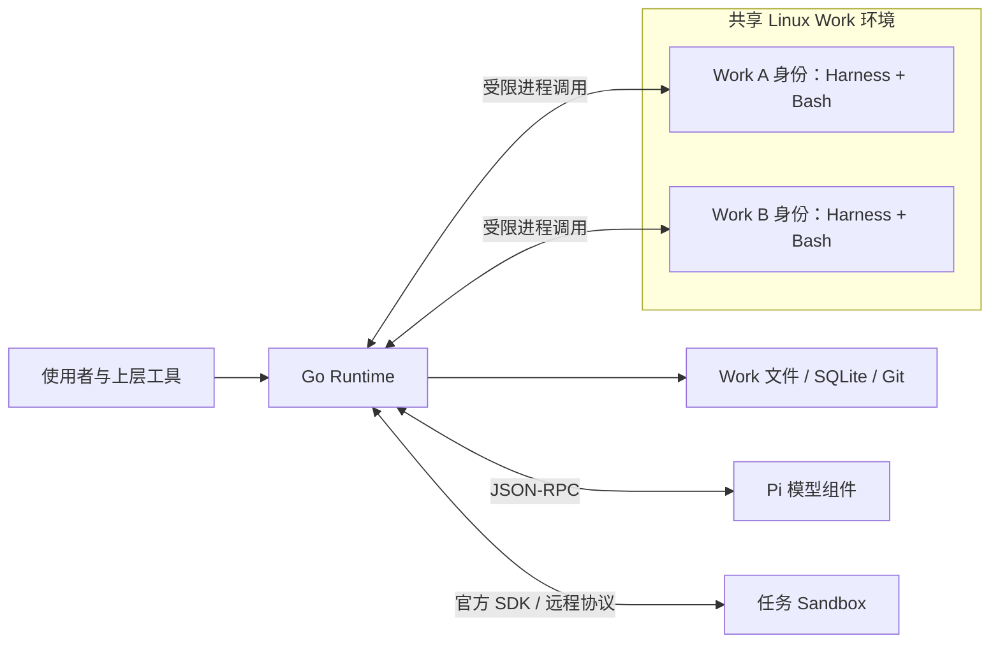

# 目标架构：Runtime、Work 与任务执行边界

状态：目标落地设计，尚未完整实现。系统目标、边界与不变量统一见 [SPEC.md](../SPEC.md)；[architecture.md](architecture.md)、源码、锁文件和 [contracts/](contracts/) 描述当前实现。本文细化技术选择、目录、协议、持久提交与验收事项，不以当前实现缩小目标，也不把设计当作完成证据。

## 组件与依赖方向

| 组件 | 职责 | 实现边界 |
| --- | --- | --- |
| Runtime | Work 注册、输入受理、授权、调度、监听与唤醒、效果与继续点托管 | Go；不内置业务推进策略或第二套模型循环 |
| 事件与状态存储 | 完整事实、输入身份、待处理责任、执行状态、订阅游标、内容版本关联 | SQLite 事务与不可变记录；Git 另管内容版本；不等于现成事件调度平台 |
| Harness | 投影、上下文控制、工具配置、推进和协作策略 | 任意普通程序；限制环境与权限，不限制语言和表达方式 |
| 模型组件 | Provider 编解码、原生消息和活跃模型—工具循环 | 复用 Pi；不自行选择、归档或摘要上下文 |
| Work 执行环境 | Harness 与 Work Bash 的运行、文件访问和资源限制 | 同一部署默认共享 Linux 环境，按 Work 区分受限进程身份 |
| 任务 Sandbox | 任务代码、浏览器、桌面等预制环境 | 独立远程服务；使用成熟执行平台及官方 SDK |
| 上层工具 | 初始化、目录组装、fork、Harness 分支及 worktree 管理 | 普通文件操作、Git 和便利 CLI；不进入 Runtime 核心 |



组件独立不要求每个内部包成为服务，也不要求统一编程语言。跨组件只传契约数据和明确引用，不依赖对方的内部模块。Runtime 决定操作是否获准并保存执行责任，Harness 决定为何及何时使用能力。

Harness 与模型发起的任务工具请求经过 Runtime 的授权和效果托管，再调用任务执行服务；不能向受限 Harness 下放 Sandbox 管理凭据或另开未记账的控制路径。模型组件可以按需启动，独立职责不意味着为每个等待 Work 保留模型服务进程。

## 事件底座与存储分工

当前文档基线采用 **SQLite 作为事件与控制责任的事务账本**，不是把 SQLite 称为现成的消息中间件或持久工作流平台。受理、订阅、交付和唤醒仍需 Runtime 按契约组合，并接受组件及系统验证。

| 设施 | 权威内容 | 不承担 |
| --- | --- | --- |
| 每个 Work 的 SQLite 账本 | 稳定请求绑定、不可变事实索引、待处理责任、Round/效果状态、订阅/交付进度和检查点引用 | 文件版本引擎、模型循环、任务业务依赖 |
| 不可变记录文件 | 数据库引用的完整模型/工具输入输出、原生结果、继续点及其他大记录 | 独立推进状态或第二套可编辑事实库 |
| Git 内容版本 | 实际使用的 Surface、策略、可见性、投影及受管理任务内容/依赖快照的版本关联 | 事件消费游标、权限、外部效果撤销 |
| Runtime 共享驱动 | 基于持久责任调度、历史补齐、受控交付、恢复核对及唤醒 | 为每个等待 Work 保留线程、连接或实例；未知效果自动重放 |
| 宿主授权与部署配置 | 物理身份、路径授权、逻辑服务解析及凭据引用 | 随 Work 迁移的可移植授权 |

跨 Work 交付为可恢复的至少一次交付，接收端幂等；不存在跨 Work SQLite 库、Git 与执行服务的全局事务。共享通知仅减少发现延迟，不能是唯一待办来源。SQLite 基线不意味着系统只能部署一个 Runtime，也不意味着可以让多个实例未经协调写入同一 Work。

**选型来源与待确认项。** 最近保存的目标设计（提交 `17346e2`）明确采用 SQLite 事件与状态存储，本次整理沿用这条目标记录。更早的设计（`77e7db9` 的父版本，`design/archive/g2/synthesis.md`）选择 NATS JetStream 保存事件历史、SQLite 保存控制责任；Temporal 调研（`12b7b4a`，`design/g3/x/temporal-research-2026-09-16.md` §12）只将其列为机制参照和规模化候选。最新目标与历史 NATS 选择存在变化，尚需确认用户所指的“既有修正”是否要恢复 NATS；不能仅凭当前实现推断目标，也不能把 Temporal 研究写成已选型。

若将 NATS 或持久调度平台确认为目标，应明确事件权威归属、与 Work 账本的受理/交付边界、导出依赖及未知效果处理，并替换这里的选型；不能在原账本之外再建立竞争的事实源。协议字段和组件适配在选型确认后细化，不提前引入第二套生产路径。

## 参考源码布局

目标源码目录如下；文档不要求提前移动现有生产目录：

```text
runtime/                    Go 控制端、存储、授权及协议客户端
services/model/             独立 Pi 模型组件
harnesses/worksurface/       最简 Harness 示例
templates/work/             初始 Work 与 Surface 模板
contracts/                  跨组件协议和数据 schema
deploy/work-environment/    共享 Work 环境配置
deploy/sandbox/             任务 Sandbox 配置
```

这些是源码职责分组，不要求新增自有 `sandbox.proto` 或事件执行引擎；优先使用执行平台已有协议及官方 SDK。

## Work：数据与策略

Work 是持久责任单元，执行进程只是临时载体。建议的最简布局：

```text
work/
  work.toml                 入口、模型和环境要求；不含秘密
  harness/                  普通策略项目，或共享版本的只读引用
  surface/
    index.md                长期上下文模板
    notes.md                普通工作资料
    ...
  context/
    selection.json          可见性状态示例，格式由 Harness 定义
  userspace/                可选任务文件或明确的外部依赖引用
  .loom/
    state.sqlite            事实索引、待办、执行及订阅状态
    records/                完整原始模型、工具和其他记录
    views/                  供普通文件工具读取的只读事实视图
    projection/             当前投影和来源清单
    versions.git/           内容、策略、可见性及投影版本
    dependencies/           外部依赖快照与可验证引用
```

业务文件可以自由增加。模型直接编辑普通文件；隐藏目录组织系统数据，隐藏本身不提供安全性。完整事实只有一个权威来源，`views/` 是可重建的读取视图，不是另一套可写事实库。

目录嵌套不授予访问权限。`userspace/` 即使位于 Work 内，也只以授权子树交给任务 Sandbox，不能顺带暴露 Surface 或 `.loom/`；Work 进程同样只获得自己的受限视图。外部 Userspace 可以使用持久卷或内容交接，不把远端挂载本地路径当作默认能力。

运行时注册、物理 UID/GID、宿主路径身份、服务管理配置和凭据不随 Work 携带。平时允许用软链复用 Harness、模板及其他授权内容；软链只是路径引用。导出必须物化或收集必要的依赖闭包，不能把无法在目的环境解析的宿主路径当作完整 Work。新宿主重新建立物理授权。

## Surface、事实与投影

Surface 是长期维护的上下文模板及其引用文件，每次模型输入都依据它组织。初始文件由 Work 模板和目录组装提供，后续由使用者及模型维护；Harness 负责渲染及推进，不拥有“决定创建哪些 Surface”的职责。

默认模板使用 Markdown 文件引用，例如：

````markdown
# 工作目标

理解并改进当前项目的架构。

# 已确认信息

```file path="surface/notes.md"
```

# 当前关注代码

```file path="userspace/src/main.go" lines="20:80"
```
````

Fence 语法是默认 Harness 的文件引用约定，不是 Runtime 的执行语言。渲染保留路径、范围和版本来源；相对路径按接收 Work 的逻辑根解析，而非共享模板的物理存放位置。缺文件、越权和失效范围必须明确报告；引用内容默认是数据，不递归执行为模板或脚本。

这里的 Userspace 引用必须指向已持久化、授权且可追溯的内容。Fence 不得隐式穿透网络读取活跃 Sandbox 内部文件；远端文件通过显式工具读取或交接，保存来源、版本、内容及结果状态后进入投影。允许授权的跨 Work 只读引用，不把“禁止隐式远端读取”扩大为“只能引用自身目录”。工具观测进入事实记录不自动证明内容为真或任务成功。

数据流：

```text
Surface 模板及引用文件 + 完整事实中的当前可见部分
    → Harness 投影策略
    → 持久化的当前投影
    → 模型组件适配
    → 模型实际可见上下文
```

当前投影是可保存、可复用的派生结果，不要求每次重放全部历史。如何复用和增量更新由 Harness 决定。投影来源包括 Harness 版本、模板与引用文件版本、事实边界和可见性状态；文件或策略变化不能被缓存忽略。

每次调用都保存实际模型输入及工具声明，并关联投影来源。仅保存策略代码后重跑不足以恢复原始输入：普通程序可以读取时间、随机数或变化的数据。模型组件保留原生消息、图像、工具调用和反馈语义，不额外删选或摘要内容。

## 上下文控制与 Archive

完整事实至少覆盖用户输入、模型请求及响应、工具请求及结果、外部事件、可见性决定、必要文件版本和执行继续点。大记录可以保存为不可变文件，由数据库及版本记录引用；不能因当前投影不使用就删除原文。

Archive 只改变当前可见性，重新引入同样只改变选择。模型通过 Bash 编辑 `context/` 下的普通文件表达意图，Harness 验证并应用；无需专用 archive、recall 或文件 CRUD 工具。选择变化本身可追溯，工具请求与结果等结构关系保持有效。

最简策略可以保留近期完整交互，并让模型调整历史选择。上下文超限由 Harness 处理并记录决定，不由 Runtime 或模型适配层暗中截断。Surface 的长期渲染与事实流的历史选择分开处理，不能把二者都变成自动删除前缀。

## Harness 与 Git 演进

Harness 是完整普通程序，入口契约只定义请求、响应和错误形状。它可以使用任何控制流和环境中可用的库；目录、schema 和便利库都不能发展成要求模型额外学习的策略 DSL。

初始化示例可显式展示扩展点，但不强制这种代码拆分：

```text
harness/
  manifest.json             程序入口及协议信息
  main.py
  projection.py             投影
  context.py                上下文控制
  tools.py                  工具配置
  advance.py                推进与事件处理
```

最简 `worksurface` 提供长期 Surface 渲染、事实选择、Bash 与基本推进。Plan 是可选派生策略，通过普通计划文件和代码加入；初始计划文件由所选 Work 模板提供，不成为 Runtime 内置阶段模型。

Harness 的演进是一份普通 Git 仓库的分支树：从 worksurface 基础版本派生 plan 或其他策略，需要时正常合并。上层使用 worktree 同时检出多个版本，并让不同 Work 指向不同目录。Runtime 不解析分支关系，不提供继承 DSL 或合并引擎，只绑定每次推进实际执行的代码版本。

共享版本只读。允许编辑的私有 Harness 产生新版本，在明确的后续推进边界启用；不能让一次执行混用变更前后的代码。对比策略时固定必要输入，同时隔离可写输出和外部效果。

## 一个共享 Work 环境，多个受限身份

同一部署默认只有一套共享 Linux Work 环境，复用操作系统、语言依赖、工具和实际文件系统。增加 Work 不要求创建新容器或虚拟机；活跃 Work 启动普通受限进程或轻量会话，等待时只保留持久状态。

macOS 宿主由成熟 Linux 运行设施提供这个共享环境，不把 bubblewrap 当作 macOS 原生能力。控制面、Work 环境和任务 Sandbox 可以部署在不同位置；职责隔离不等于必须使用不同物理机器。

```text
共享环境
  /works/a/     Work A 的文件
  /works/b/     Work B 的文件

  Work A 活跃：以 A 的身份运行 Harness 和 Bash
  Work B 活跃：以 B 的身份运行 Harness 和 Bash
```

同一 Work 的 Harness 与 Bash 受同一权限上限约束，不能给 Harness 放入额外控制凭据。共享环境不能退化成所有进程共用同一特权 UID，仅靠 `cwd` 区分。

| 内容 | 执行进程权限 |
| --- | --- |
| 自己授权的 Surface、上下文、私有策略目录 | 可读写 |
| 其他 Work 授权共享的内容 | 只读 |
| 共享 Harness、事实视图和历史 | 只读 |
| Runtime 控制数据、权限配置和凭据 | 不开放 |

Unix 身份、组及 ACL 表达访问关系，但文件拥有者可能修改文件权限，单靠这些机制不能保证跨 Work 的只读上限。复用成熟的受限进程机制（如 bubblewrap）固定可见路径和只读/可写范围，并限制提权、进程和网络访问；不自行实现 namespace、系统调用过滤器或隔离引擎。受限视图仍指向共享文件，不需要复制每份 Work 或启动独立系统。具体 profile 必须验证，工具名称本身不构成隔离证明。

Work 根及系统目录的父目录由控制身份保护，避免重命名或替换。权限不得经继承文件描述符、控制 socket、管理服务或残留后台进程绕过。执行身份映射由可信部署设施提供；Runtime 请求授权范围内的执行，不能让模型自报 UID、端点或权限。

CPU、内存、进程等资源约束使用现成设施。共享环境具有共同故障域，不能将其描述成每个 Work 独立 VM 的隔离强度。等待时释放 Work 专属进程；切换写入者或回收身份前，必须确认旧进程已停止或失去实际写能力。

## Bash、跨 Work 访问与任务 Sandbox

模型使用统一普通 Bash，环境选择作为调用元数据：

```text
bash(environment="work", command="...")
bash(environment="sandbox", command="...")
```

`work` 指向共享环境中当前 Work 的受限执行身份，`sandbox` 指向获准的任务环境。Runtime 不分析命令内容来猜测路由，不因缺少执行服务而回退到宿主 Shell。

跨 Work 读取是普通路径操作，例如 `cat /works/research/surface/notes.md`。日常查看可以访问当前文件；精确投影、证据引用和恢复使用确定版本或保存实际读取内容，不能只保存可能变化的路径。模板、文件和引用的权限检查一致，软链不授予额外访问权。

任务 Sandbox 单独提供代码、浏览器和桌面等预制环境，网络、设备、依赖按任务用途配置。它通过远程协议访问，不因共享 Work 环境而获得其他 Work 或 Runtime 状态。优先复用已有 OpenSandbox 服务及官方 SDK；不复制浏览器自动化、桌面控制或远程执行引擎。

同一活跃推进可以复用获准 Sandbox，不要求每条工具命令都创建新实例。按环境 profile 授予实例内安装或 root 能力，不扩大为宿主 root 或控制权限。Userspace 的持久卷/交接方式显式配置；缓存为可丢弃优化，共享写入另有授权及一致性边界。

## 声明式环境、就绪与回收

环境要求可来自 Work 声明或 Userspace 中的规范，由成熟供给组件解析和构建。Runtime 校验授权、绑定可追溯镜像/配置与资源上限，保存申请身份后调用平台，不承担新环境语言的解释器职责。

创建、初始化、就绪验证、活跃执行、产物交接和释放是不同阶段。任何用户代码（包括初始化脚本）运行前，先建立并核验执行身份、授权文件绑定、网络与安全隔离上限。初始化脚本退出成功只是一条结果；进入 Ready 还必须核验依赖、执行通道、必要服务，并复核文件绑定及隔离条件。浏览器、桌面、音视频等能力按选定 profile 检查，不能用一个通用退出码代替。

退出、断连、租约到期或发出删除请求均不能独自证明远端资源已停止。失败和不确定保留原实例/请求身份与回收责任；必要结果持久化、写入停止、发布无冲突且释放得到确认后，才完成交接。等待时可释放任务专属进程、连接和 Sandbox，共享基础设施与持久数据保留。

## 协议与持久协作

| 交互 | 契约 |
| --- | --- |
| Runtime ↔ Harness | JSON-RPC 2.0；连接与请求绑定实际 Work 身份，校验策略结果及授权 |
| Runtime ↔ 模型组件 | 私有 JSON-RPC；沿用 Pi 原生消息、工具、事件和继续点语义 |
| Runtime ↔ 执行服务 | 官方 SDK 和服务已有的执行、文件及生命周期协议 |
| Work 间事件 | 稳定来源及事件身份、明确类型和 JSON 数据，由 Runtime 持久交付 |
| Runtime ↔ 存储 | SQLite 事务、Git 与普通文件接口 |

可直连的 Harness 进程使用 stdio；跨执行服务时适配其现有输入输出能力。当前锁定 SDK 的交互式 stdin 未确认，不能宣称现有 stdio RPC 可以透明远程搬迁，也不能仅为通信放开未经认证的执行管理端点。调用承载方式属于实施前需要验证的工程选择。

Harness 定义依赖哪个 Work 的什么事件以及收到后如何处理。Runtime 持久保存订阅和游标，补齐已发生事件、监听后续事件、去重、保存目标输入后唤醒。事件先进入事实，再由 Harness 决定怎样投影。上层业务可以构造任意关系，Runtime 不预设父子树、DAG 或通用 done/fail 语义。

跨库交付不假装拥有全局事务：允许至少一次投递，以稳定来源身份去重；保存目标输入后再推进交付游标。崩溃后的再次交付不能变成再次受理或工具重放。

目标已保存输入而发送侧未保存确认时，恢复驱动可以按原身份、原内容、原目的地核对或重投；前提是接收端具备永久的身份/内容绑定与原子幂等受理契约。不能依赖短期去重窗口，不能换新事件身份，也不能把此规则用于结果未知的模型/工具执行重放。

## 全历史、当前投影与回拨

Harness 的分支演进和 Work 的执行历史使用不同的 Git 职责。前者由上层管理；后者保存实际使用过的 Surface、引用内容、策略、可见性及投影。Git 不替代事实存储，SQLite 不重新实现文件版本引擎。

一个恢复点关联事实边界、文件与 Harness 版本、可见性与投影、实际模型输入、模型/工具执行阶段、Userspace 版本，以及已知和未决效果。记录粒度覆盖已记录事件和执行检查点，不仅是 Round 结束；操作内部没有保存的瞬间不承诺重建。

内容与 Git 对象先持久保存，再由 SQLite 事务提交引用它们的检查点。当前指针、缓存和只读视图可以从已提交记录恢复。并发写入必须协调，不能把多个独立文件和数据库写入当作一次原子操作。

Round 结束是聚合提交点，不替代效果边界落盘。每次模型/工具调用前先保存身份、请求及目的地，原生结果和继续点在确认前持久化。无需每条 Shell 指令都做可回滚快照，但不能把唯一必要状态留到回合结束才从临时实例收集。

查看历史保留后续记录；接续最新确认的同一责任使用原生继续点。从旧点开启另一条尝试创建新 Work，记录分叉关系并隔离可写内容和任务环境。文件回退作为新的内容变更记录，不撤销外部世界；禁止删除后续记录并伪装效果未发生。未知模型或工具效果保持原身份和责任，不能因进程消失、租约超时或回拨而自动重发。精确恢复中间工具阶段需要模型组件原生支持，不能由 Runtime 再造一套循环猜测。

## 创建、fork 与安装使用

在可写位置用 `mkdir`、`cp`、`ln`、Git worktree 等操作组装目录，然后由控制层注册身份及授权。常用模式可以封装为便利 CLI，不要求模型学习新的内容操作工具。

| 模式 | 共享部分 | 独立部分 |
| --- | --- | --- |
| 新任务 | Harness、初始模板 | 事实、选择状态、工作文件 |
| 并行探索 | Harness、确定版本的 Surface 与输入 | 后续事实、可写内容和输出 |
| 策略对比 | 相同输入及 Surface 基点 | Harness 版本、执行状态和输出 |
| 历史分叉 | 确定恢复点及历史引用 | 后续推进和新状态 |

新 Work 使用新身份。复用不可变历史不复制活跃 owner、宿主授权或未决效果的重放权；原责任不会因 fork 消失。共享 Surface 需要写入时先得到私有副本。交接同一责任与创建新 Work 是不同操作。

安装及首次配置完成组件和共享环境准备、服务绑定及凭据配置。日常流程只需创建/选择 Work、输入任务、查看结果，以及必要时恢复或分叉。Git 分支与 worktree 是演进 Harness 的上层能力，不是每个使用者必须操作的步骤。安装器复用成熟运行设施，不自行实现虚拟化。

## 实现差距与验收

本节仅说明实现状态，不能用于反向收缩前面的目标。目标系统的整体必要性质统一见 [SPEC.md 的验收边界](../SPEC.md#9-目标验收边界)。

| 范围 | 当前实现 | 待落地 |
| --- | --- | --- |
| Runtime / 模型 / 任务执行 | Go、Pi、官方 OpenSandbox SDK 已接入 | 保持职责并接入新 Work 执行边界 |
| Harness 执行 | 宿主本地子进程，继承进程身份 | 共享环境内的受限身份与进程调用 |
| Work 执行 | Surface 命令每次创建独立远程环境 | 共享文件系统及按 Work 授权的轻量执行 |
| Surface / Archive | Kernel 初始投影与自动门槛归档 | 长期模板、模型控制可见性及持久投影 |
| 策略与初始化 | 固定 Harness 摘要，Kernel 提供初始文件 | 上层模板组装、只读共享与可追溯策略更新 |
| 多 Work 协作 | 已有受控 relay | 持久订阅、补齐、去重与唤醒 |
| 历史恢复 | Round Surface 版本和部分原生继续点 | 各记录边界的一致版本索引及恢复/分叉 |
| 安装 | 源码安装、setup/new/ask 已有 | 共享 Work 环境的一次准备和正常使用流程 |

实施前先确定相关协议、正常与负向用例，再替换旧路径。用户要求不保留兼容实现；必要时明确拒绝旧 Work 格式，不能用兼容层掩盖语义差异。原有测试按当前契约保留其证据范围，不能因通过而宣称新目标完成。

独立验收需要直接观察以下事实：

1. 任意普通 Harness 程序与 Bash 在预定权限内运行，创建多个 Work 不增加同等数量的容器或 VM；等待 Work 不保留专属执行进程。
2. A 能读取授权的 B 内容，无法写入 B 或控制数据；chmod、软链、父目录替换、继承句柄和后台子进程不能突破上限。
3. 修改模板或引用文件影响下一次投影，当前投影可以复用且来源正确；实际模型输入与保存版本一致。
4. Archive/重新引入改变可见性，完整原始事实保持可读，原生工具关系不被破坏；Plan 不成为必需能力。
5. 重复事件只形成一次受理；订阅前后竞态、进程退出和重复唤醒不丢输入、不重放未知效果。
6. 每个已记录点能够查看或恢复其上下文及内容版本；从旧点继续保留后续历史和未决责任。
7. 导出收集共享依赖，迁移和 fork 使用新的物理授权；复制目录或 Unix 身份不能取得旧宿主权限。
8. 模型、工具和执行服务中断时，已保存责任及原始结果仍存在；服务不可用没有宿主执行回退。

共享多身份执行的真实权限语义、远程 Harness 输入输出、原生中间阶段恢复，以及持久文件的一致边界目前仍需实现与组合验证。现有组件检查或旧版系统证据不能替代这些验收。

## 复用设施参考

- [bubblewrap](https://github.com/containers/bubblewrap)：文件系统、进程和网络的受限视图；安全性取决于实际配置。
- [Linux ACL](https://man7.org/linux/man-pages/man5/acl.5.html)：普通用户及组的文件权限关系。
- [Linux cgroup v2](https://docs.kernel.org/admin-guide/cgroup-v2.html)：进程组资源控制。
- [OpenSandbox SDK](https://open-sandbox.ai/sdks/)：执行、文件与生命周期接口；默认分支文档不代表当前锁定版本均已支持或验证。
